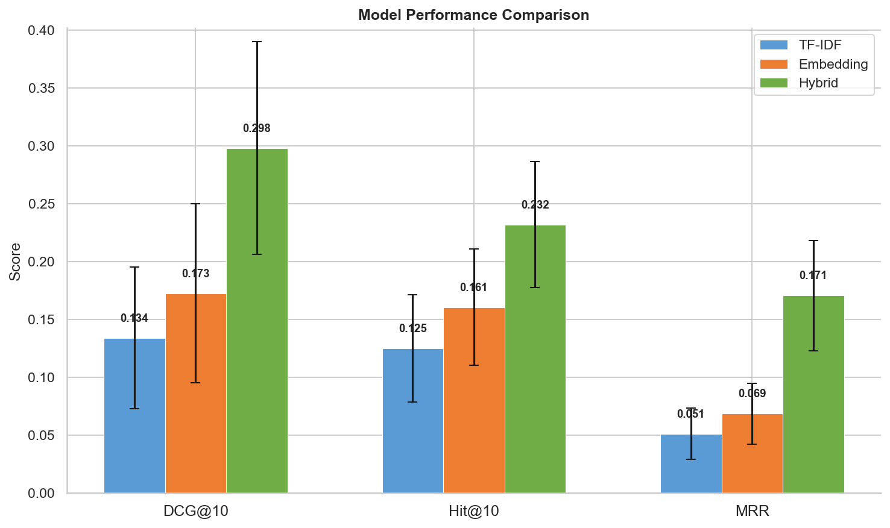
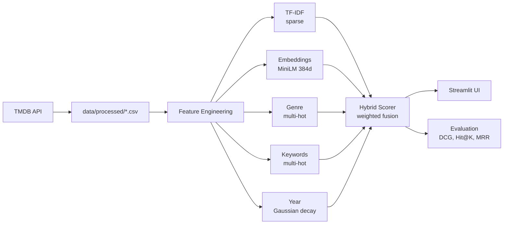

# Korean Movie Recommender

[](https://www.python.org/downloads/)
[](https://github.com/taehan1024/korean-movie-recommender/actions)
[](https://korean-movie-recommender-dbs65tfqxee5tdixtse4o6.streamlit.app)
[](LICENSE)

Cross-cultural content-based movie recommender: enter a US movie, get ranked Korean movie recommendations with explanations.

**[Try the live demo](https://korean-movie-recommender-dbs65tfqxee5tdixtse4o6.streamlit.app)**

## Problem

Korean cinema has a deep catalog that Western audiences rarely discover. A viewer who loved *Se7en* might equally love *I Saw the Devil*, but has no way to find it. Collaborative filtering doesn't help — there's zero user-overlap data between US and KR movie audiences. This system bridges the gap using only content: plot synopses, genres, keywords, and metadata.

## Results



| Model | DCG@10 | Hit@10 | MRR | nDCG@10 |
|---|---|---|---|---|
| TF-IDF + Cosine | 0.134 | 0.125 | 0.073 | 0.057 |
| Sentence Embeddings | 0.173 | 0.161 | 0.108 | 0.066 |
| **Hybrid (tuned)** | **0.298** | **0.232** | **0.171** | **0.123** |

The hybrid model achieves **+72% DCG@10** over the best single-feature model, evaluated on 174 gold pairs across 56 queries with bootstrap confidence intervals.

## How It Works



## Technical Highlights

- **5-dimensional hybrid scoring** — text similarity, genre Jaccard, keyword Jaccard, year proximity, and cast overlap, fused with grid-search-tuned weights
- **Cross-catalog keyword bridge** — only keywords appearing in *both* US and KR catalogs are used (1,768 of ~30K), tripling thematic match detection
- **Grid search over 288 weight combinations** — found that cast features contribute zero signal (0.8% cross-industry person overlap), optimal weights: `text=0.47, genre=0.24, keyword=0.18, year=0.11, cast=0.00`
- **Graded relevance evaluation** — remakes (rel=3), thematic matches (rel=2), genre matches (rel=1) with DCG as primary metric per [Jeunen et al. (KDD 2024)](https://arxiv.org/abs/2307.06517)
- **Bootstrap confidence intervals** — all metrics reported with standard errors (56 queries makes point estimates unreliable)
- **Concurrent data ingestion** — token bucket rate limiter across 4 threads for 3.5x speedup over sequential TMDB API fetching

## Quick Start

```bash
# Clone and setup
git clone https://github.com/taehan1024/korean-movie-recommender.git
cd korean-movie-recommender
make setup

# Add your TMDB API key (free at themoviedb.org/settings/api)
echo "TMDB_API_KEY=your_key_here" > .env

# Run the pipeline
make ingest           # Fetch 5,000 US + 1,512 KR movies from TMDB
make fetch-keywords   # Add TMDB keywords to movie catalogs
make features         # Build all feature matrices
make eval             # Benchmark models on gold evaluation set

# Launch the app
make app              # Opens Streamlit UI at localhost:8501

# Run tests
make test             # Unit tests with synthetic fixtures
```

## Project Structure

```
korean-movie-recommender/
├── models.py               # 3 recommendation models + hybrid scoring
├── feature_engineering.py   # TF-IDF, embeddings, genre/keyword/cast/year encoding
├── evaluate.py              # Benchmarking with Hit@K, MRR, DCG@10, grid search
├── data_ingestion.py        # TMDB API fetch, rate limiting, CSV export
├── fetch_keywords.py        # Add TMDB keywords to existing catalogs
├── curate_eval_pairs.py     # Semi-automated gold pair curation
├── utils.py                 # Shared utilities (token bucket rate limiter)
├── app_v2.py                # Streamlit UI
├── Makefile                 # Pipeline automation
├── report.md                # Detailed technical report
├── notebooks/
│   ├── analysis.ipynb       # Visualizations and model analysis
│   └── figures/             # Exported plots
├── tests/                   # Unit tests (synthetic fixtures, no data needed)
├── data/
│   ├── eval/                # Gold evaluation pairs (committed)
│   ├── processed/           # Movie CSVs (generated)
│   ├── features/            # Feature matrices (generated)
│   └── raw/                 # Raw API responses (generated)
└── results/                 # Benchmark metrics (generated)
```

## Evaluation Methodology

**Gold set:** 174 curated US-KR pairs — 3 remakes, ~21 thematic matches, ~150 genre matches.

**Primary metric:** DCG@10 (unnormalized), following [Jeunen et al. (KDD 2024)](https://arxiv.org/abs/2307.06517) — nDCG normalization can invert method ordering.

**Grounded in:**
- [DaisyRec 2.0](https://arxiv.org/abs/2206.10848) — evaluation rigor, appropriate metrics for sparse labels
- [ReasoningRec](https://arxiv.org/abs/2312.04482) — item descriptions dominate in sparse/no-user-data settings

See [report.md](report.md) for the full technical report.

## License

MIT — see [LICENSE](LICENSE)
