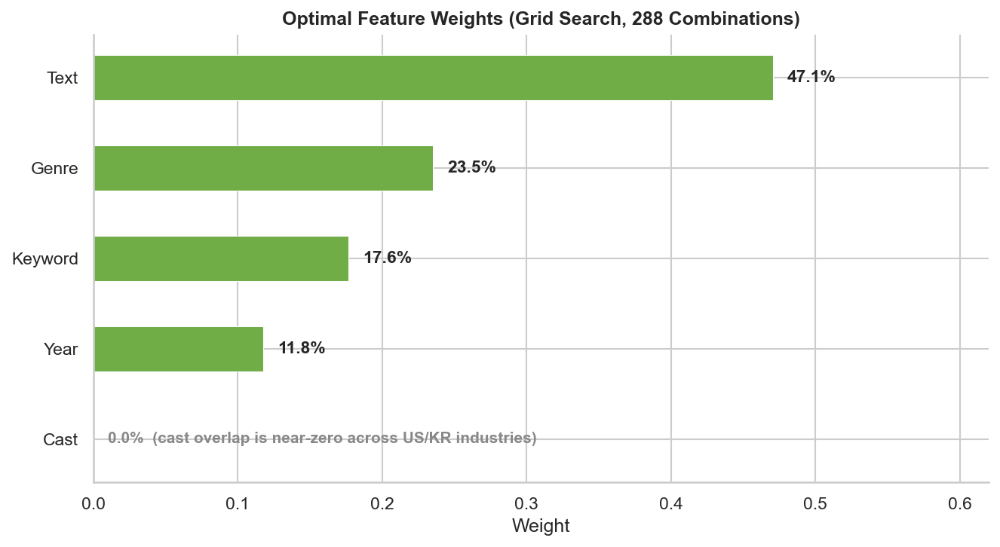
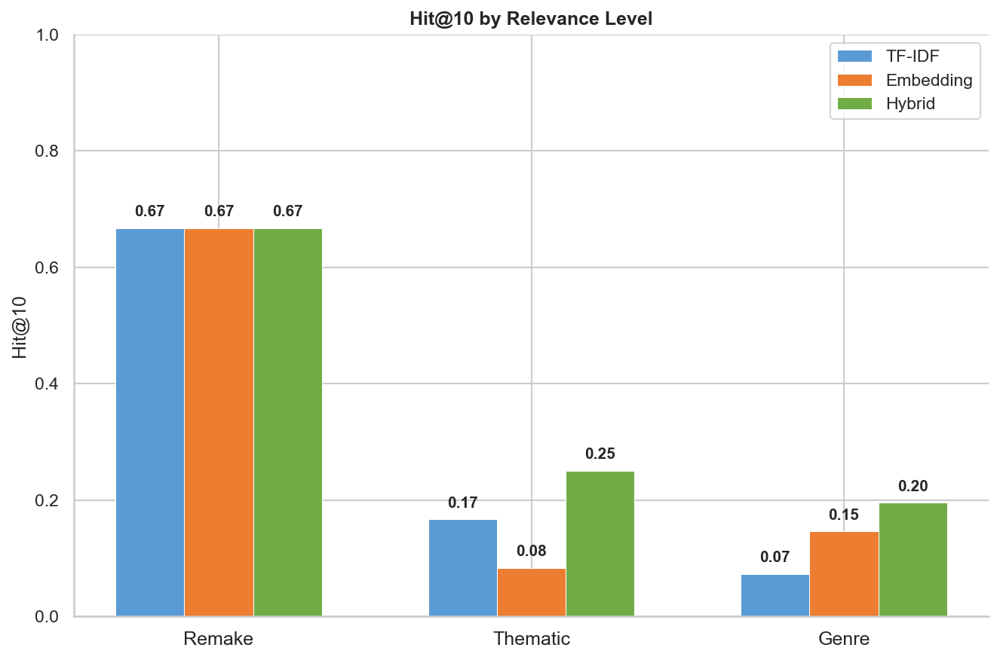
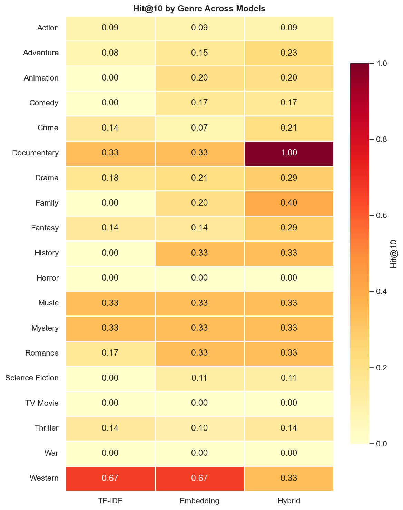

# Korean Movie Recommender: Technical Report

## 1. Problem Statement

Korean cinema has exploded in global popularity. Films like *Parasite*, *Oldboy*, and *Train to Busan* found massive audiences, but the deeper catalog remains undiscovered by most Western viewers. A US moviegoer who loved *Se7en* might equally love *I Saw the Devil*, yet has no easy way to find it.

This project builds a **cross-cultural content-based movie recommender**: given a US movie, recommend ranked Korean movies. The core challenge is bridging two film industries with minimal overlap in cast, crew, and cultural context. Unlike typical recommendation systems, we have **zero user interaction data** — no ratings, no watch history, no collaborative signals. The system must work purely from content: plot synopses, genres, keywords, and metadata.

### Why Content-Based?

Collaborative filtering dominates modern recommendation (Netflix, Spotify), but it requires user-item interaction matrices. Cross-domain techniques like TMCDR (Zhu et al., 2021) use overlapping users to bridge domains, but US-KR movie audiences have effectively zero overlap in any available dataset. Content features are our only "bridge" between the two catalogs.

This constraint actually simplifies the problem: we don't need to model user preferences, just item-to-item similarity. The question becomes: *can we measure meaningful similarity between American and Korean films using only their textual descriptions and metadata?*

---

## 2. Data

### Source

All data comes from [The Movie Database (TMDB)](https://www.themoviedb.org/) API. A single source provides everything needed: plot overviews, genres, keywords, cast, crew, ratings, and poster images. This eliminates the data integration complexity of combining multiple sources (e.g., IMDb + OMDb + Wikipedia).

### Catalogs

| Catalog | Movies | Selection Criteria |
|---|---|---|
| US | 5,000 | Top-rated English-language films on TMDB |
| Korean | 1,512 | All Korean-language films with 10+ votes on TMDB |

### A Surprising Finding: Translation Was Not Needed

An early assumption was that cross-lingual text would be a major bottleneck — Korean synopses would need translation before English-language models could process them. Investigation revealed this was wrong: **TMDB provides English-language overviews for 99.9% of Korean movies** (only 1 of 1,512 needed our own translation). Both catalogs have comparable text quality (US mean overview length: 266 characters, KR: 271 characters).

This finding deprioritized the entire multilingual embeddings track and redirected effort toward features that actually matter.

### Data Pipeline

```
TMDB API -> data/raw/*.json -> data/processed/*.csv
```

Rate limiting uses a **token bucket** shared across 4 concurrent threads (35 requests per 10-second window, against TMDB's 40 req/10s ceiling). This achieves ~3.5x speedup over sequential fetching. Checkpoints every 200 records enable crash recovery.

Keywords are fetched separately via TMDB's `/movie/{id}/keywords` endpoint, adding a pipe-delimited `keywords` column to existing CSVs (e.g., `serial killer|time travel|revenge`).

---

## 3. Feature Engineering

### Text Features

**TF-IDF (sparse).** Fit on the combined US+KR corpus to create a shared vocabulary. This ensures the same terms in both catalogs map to the same feature dimensions. Cosine similarity between TF-IDF vectors captures literal word overlap.

**Sentence Embeddings (dense).** `all-MiniLM-L6-v2` (384-dimensional) encodes each movie's overview into a dense vector. This captures semantic similarity beyond exact word matching — "a man seeks vengeance" and "a woman plots revenge" score high despite different words. The model is 80MB, free, and runs locally.

### Structured Features

**Genre multi-hot.** 19 TMDB genres encoded as binary vectors. Similarity is Jaccard: `|intersection| / |union|`. Two movies sharing `Thriller|Crime` score higher than two sharing only `Drama`.

**Keyword multi-hot.** TMDB keywords provide much finer-grained thematic information than genres. However, many keywords are culture-specific (e.g., "American football" appears only in US films). To focus on the cross-cultural bridge, we use only **keywords appearing in both catalogs** — 1,768 out of tens of thousands. Similarity is Jaccard, same as genres.

**Year proximity.** A Gaussian decay function: `exp(-(year_diff^2) / (2 * 10^2))`. Movies from the same era score ~1.0; a 20-year gap scores ~0.14. This captures the intuition that a 2010s thriller is more comparable to a 2010s Korean thriller than to a 1990s one.

**Cast/crew multi-hot.** Binary encoding of top-5 billed actors and director. Only 46 people (0.8%) appear in both catalogs — almost entirely directors who crossed industries (Bong Joon-ho, Park Chan-wook, Kim Jee-woon). Grid search confirmed this feature is pure noise (optimal weight: 0.0), though it remains available for future use.

---

## 4. Models

### Baseline: TF-IDF + Cosine

Sparse bag-of-words on plot synopses. Simple, fast, interpretable. Captures literal word overlap but misses paraphrase and semantic similarity. DCG@10 = 0.134.

### Sentence Embeddings + Cosine

Dense 384-dim vectors from all-MiniLM-L6-v2. Captures semantic similarity. DCG@10 = 0.173 (+29% over TF-IDF).

### Hybrid (Tuned)

Weighted combination of five signals, each min-max normalized to [0, 1] before fusion. Grid search over 288 weight combinations found the optimal allocation:

```
text=0.47, genre=0.24, keyword=0.18, cast=0.00, year=0.11
```

DCG@10 = 0.298 (+72% over the best single-feature model).

**Why does the hybrid succeed?** Three factors:

1. **Keywords add thematic signal.** Genres are too coarse — both *The Dark Knight* and *My Sassy Girl* can be tagged "Drama". Keywords like "serial killer", "class struggle", "revenge" capture what actually makes movies thematically similar across cultures. Adding keywords tripled thematic Hit@10 (from 0.083 to 0.250).

2. **Cast contributes zero signal.** Grid search confirmed what the data suggested: 0.8% person overlap means cast is noise, not signal. Removing it entirely improved results.

3. **Year proximity softens temporal mismatch.** Korean cinema's golden age (2000s-2010s) overlaps heavily with the US movies in our catalog. Year proximity helps surface era-appropriate matches.



---

## 5. Evaluation

### Metric Selection

Early iterations used Precision@K, which was **mathematically misleading**: with only ~3 gold matches per query movie, a perfect model achieves P@10 = 0.30. Following DaisyRec 2.0 (Sun et al., 2022) on evaluation methodology, we use metrics appropriate for sparse labels:

| Metric | Why |
|---|---|
| **DCG@10** (primary) | Graded relevance (remakes=3, thematic=2, genre=1). Unnormalized per Jeunen et al. (KDD 2024) — nDCG normalization can invert method ordering |
| **Hit@10** | Did we find ANY relevant movie in top-10? Binary, intuitive |
| **MRR** | How high does the first relevant movie rank? Captures user experience |
| **R@10** | What fraction of relevant movies did we find? |

### Gold Evaluation Set

174 curated US-KR movie pairs across three relevance levels:

- **Remake (3):** Direct remakes/adaptations. E.g., *Oldboy* (US 2013) <-> *Oldboy* (KR 2003). Strongest possible match. Only 3 pairs — US-KR remakes are rare.
- **Thematic (2):** Similar themes, tone, plot structure. E.g., *Zodiac* <-> *Memories of Murder* (serial killer investigation procedurals). ~21 pairs.
- **Genre (1):** Same genre with some topical overlap. E.g., *Gravity* <-> *Space Sweepers*. ~150 pairs.

The gold set was generated semi-automatically: manually curated seed pairs for remakes and thematic matches, plus automated genre matching for broader coverage.

### Per-Relevance Analysis

| Relevance | Hit@10 | Interpretation |
|---|---|---|
| Remake (3) | 0.667 | Model finds 2/3 remakes in top-10 |
| Thematic (2) | 0.250 | Thematic matches found 1/4 of the time (3x improvement from keywords) |
| Genre (1) | 0.195 | Genre-level matches detected ~20% of the time |

Keywords had the most dramatic impact on thematic matches, tripling Hit@10. This validates the hypothesis that keywords serve as a "thematic bridge" between cultures.



### Bootstrap Confidence Intervals

With only 56 evaluation queries, point estimates are unreliable. All metrics are reported with bootstrap standard errors. For example, DCG@10 = 0.298 +/- 0.092, meaning the true value likely falls between 0.21 and 0.39.

---

## 6. Results

| Model | P@10 | R@10 | DCG@10 | nDCG@10 |
|---|---|---|---|---|
| TF-IDF | 0.013 | 0.094 | 0.134 | 0.057 |
| Embedding | 0.018 | 0.095 | 0.173 | 0.066 |
| **Hybrid (tuned)** | **0.025** | **0.125** | **0.298** | **0.123** |




---

## 7. Design Decisions

Each major decision was informed by research papers:

| Decision | Choice | Paper | Finding |
|---|---|---|---|
| Primary metric | DCG@10 | Jeunen et al. (KDD 2024) | nDCG normalization provably inconsistent |
| Text weight >= 0.5 | High text weight | ReasoningRec (2024) | Item descriptions dominate for sparse/no-user data |
| Fix eval before features | Methodology first | DaisyRec 2.0 (2022) | Hyper-factors change results completely |
| Content-based only | No collaborative | TMCDR (2021) | Cross-domain needs overlapping users (we have none) |
| Min-max normalization | Not rank normalization | Empirical | Rank normalization dropped nDCG from 0.095 to 0.029 |
| Bootstrap CIs | Mandatory | DaisyRec 2.0 | <100 queries makes point estimates unreliable |

---

## 8. Lessons Learned

1. **The target matters more than the model.** An initial hybrid attempt actually *underperformed* the standalone embedding model because cast features (weighted at 0.2) injected noise. Diagnosing what went wrong (cast overlap = 0.8%) was more valuable than trying fancier models.

2. **Fix measurement before features.** An early P@10 target was mathematically impossible given the gold set size. Without switching to Hit@K and MRR, any feature improvement would look like noise.

3. **Check data before assuming bottlenecks.** The multilingual embeddings track was deprioritized entirely once we discovered TMDB provides English overviews for 99.9% of Korean movies. A 30-second data check saved hours of engineering.

4. **Keywords are the thematic bridge.** Genres are too coarse (19 categories). Keywords capture the thematic DNA that makes cross-cultural recommendations work. This is the single highest-impact feature addition.

5. **Grid search is cheap; intuition is expensive.** 288 weight combinations ran in under 5 minutes. The grid search found cast=0.0, which no human would have set as default. Always let data choose weights.

6. **Evaluation quality bounds everything.** With 56 queries and ~3 gold matches each, bootstrap CIs are wide. The biggest remaining improvement opportunity is expanding the gold set, not changing the model.

---

## 9. Limitations and Future Work

### Current Limitations

- **Small gold set.** 174 pairs across 56 unique queries. Bootstrap SEs of ~0.09 on DCG@10 mean we can't reliably distinguish models within ~18% of each other.
- **Genre matches are noisy.** 91% of gold pairs are genre-matched (relevance=1), generated by pairing top-rated movies in the same genre. This doesn't guarantee actual similarity.
- **No user validation.** No A/B test or user study to confirm recommendations are subjectively good.
- **Static catalog.** The 1,512 KR movies represent TMDB's catalog at ingestion time. New releases require re-ingestion.

### Planned Improvements

- **Gold set expansion.** Replace noisy genre matches with embedding-filtered matches. Add ~30 manually curated thematic pairs. Target: 100+ unique queries, 300+ pairs.
- **Pooling-based labeling.** Use the model's own top-20 recommendations as candidates for human labeling — standard IR evaluation protocol.
- **LLM-assisted thematic discovery.** Use an LLM to judge thematic similarity between movie pairs at scale (~$1 for 500 judgments).

### Longer-Term Directions

- **Larger embedding model.** `all-mpnet-base-v2` (768-dim) has better semantic quality than MiniLM. Worth testing if keyword+year features plateau.
- **LLM-based recommendation.** BookGPT (2023) showed LLMs are competitive with classic algorithms in zero-shot recommendation. A future version could use LLM scoring or explanation generation.
- **User-facing explanation quality.** The current explanations show shared genres, keywords, and component scores. XRec-style (Ma et al., 2024) natural language explanations would improve user trust.

---

## References

1. Sun, Z., et al. (2022). "DaisyRec 2.0: Benchmarking Recommendation for Rigorous Evaluation." *IEEE TPAMI*.
2. Jeunen, O., et al. (2024). "On (Normalised) Discounted Cumulative Gain as an Off-Policy Evaluation Metric for Top-n Recommendation." *KDD*.
3. Bismay, S., et al. (2024). "ReasoningRec: Bridging Personalized Recommendations and Human-Interpretable Explanations." *arXiv*.
4. Zhiyuli, A., et al. (2023). "BookGPT: A General Framework for Book Recommendation Empowered by Large Language Models." *arXiv*.
5. Zhu, Y., et al. (2021). "Transfer-Meta Framework for Cross-domain Recommendation to Cold-Start Users." *SIGIR*.
6. Ma, J., et al. (2024). "XRec: Large Language Models for Explainable Recommendation." *arXiv*.
